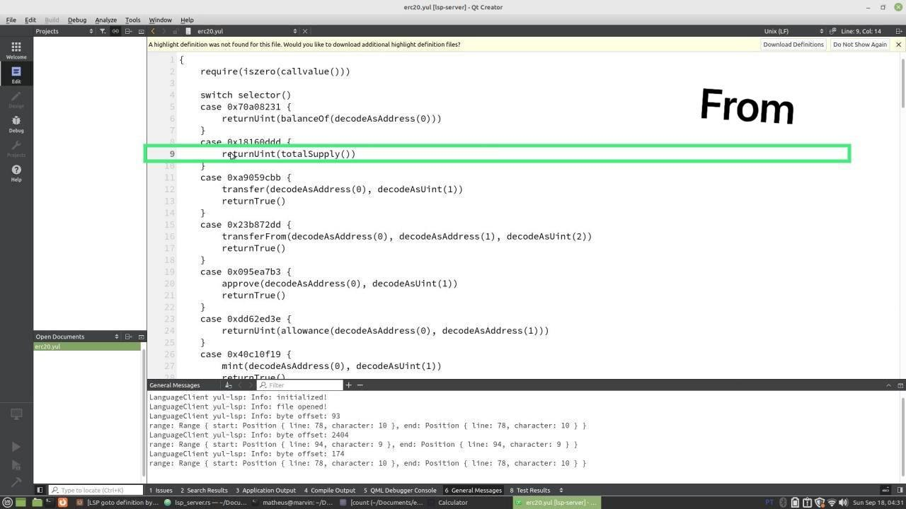
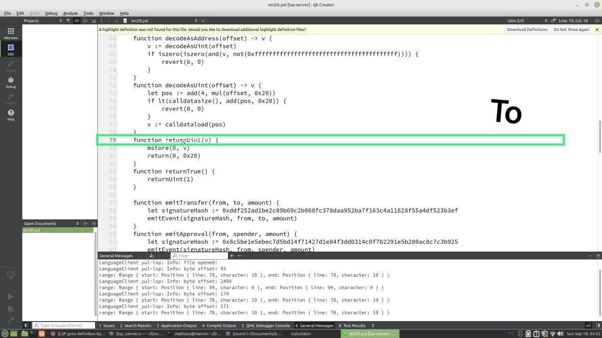

[npm]: https://www.npmjs.com/package/solidity-ls
[npm-badge]: https://img.shields.io/npm/v/solidity-ls.svg

# Yul LSP

This is an implementation of the [Language Server Protocol](https://github.com/Microsoft/language-server-protocol) for [Yul programming language](https://ethereum.org/en/developers/docs/smart-contracts/languages/#yul).

# Features

- Go to definition
  - Developer hovers to the function name.
  - Then, developer clicks on the "Go to definition" shortcut that's configured in the editor. 
  - Then the cursor points the the main function definition.
  - Screenshots:
    
    - 
    - 
- Detecting the hover event on the function selectors.
- Detecting the hovor event on the contract address.

# Features (Work in Progress)

- Get function signature from the function selector.
  - Developer hovers to a written function selector in the switch cases for instance.
  - The LSP directly makes a POST request to Dune Dashboard to fetch the function signature strings.
  - Expected to appear near to the function selector as a tool-tip:
  ```
    case 0xa9059cbb "transfer(address,uint256)" {
        transfer(decodeAsAddress(0), decodeAsUint(1))
        returnTrue()
    }
  ```
- Get contract name from the contract address.
  - Developer hovers to a written string address in a variable for instance.
  - The LSP directly makes a POST request to Dune Dashboard to fetch the contract name of that address.
  - Expected to appear near to the contract address string as a tool-tip:
  ```
    let contract_address := 0xe592427a0aece92de3edee1f18e0157c05861564 "SwapRouter"
  ```

# Usage

- Build the server
  ```
   cargo build
  ```

# Extra Usage

- Feature connecting with Dune API Setup [Dune API](https://dune.com/docs/).
  - Create an API key in the `.env` file.

```
 DUNE_API_KEY=<INSERT_YOUR_KEY>
```

# Editors configuration examples

## Qt Creator

- How to configure LSP in Qt Creator:
  - `Edit` > `Preferences` > `Language Client`.
  - Click on `Add`.
  - Choose `Generic StdIO Language Server` option.
  - Set `Name` field with `yul-lsp`.
  - Set `File pattern` field with `*.yul`.
  - Click `Browse` and then choose the location of the `yul-lsp` Executable.
  - Click `OK`.
- How to test:
  - Open the file with a Yul code. (You can start with the `example/erc20.yul`).
  - Press `f2` or the short-cut key in your editor configs to go to the identifier definition.
